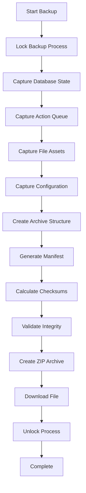
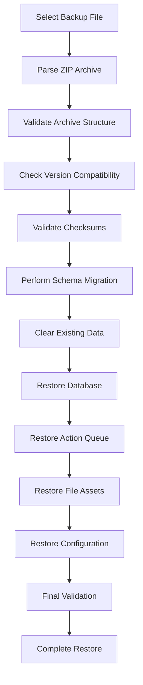

# System Backup & Restore Architecture

## Overview

This document outlines the comprehensive backup and restore system for the TechPlus POS web application, designed to provide robust data protection, integrity validation, and disaster recovery capabilities.

## High-Level Architecture

```
┌─────────────────────────────────────────────────────────────────┐
│                    POS Web Application                        │
├─────────────────────────────────────────────────────────────────┤
│  ┌─────────────────┐  ┌─────────────────┐  ┌─────────────────┐ │
│  │   UI Layer      │  │  Service Layer  │  │  Storage Layer  │ │
│  │                 │  │                 │  │                 │ │
│  │ • Backup UI     │  │ • Backup Service│  │ • IndexedDB     │ │
│  │ • Restore UI    │  │ • Validation    │  │ • LocalStorage  │ │
│  │ • Progress      │  │ • Migration     │  │ • SessionStorage│ │
│  │ • Status        │  │ • Integrity     │  │ • File System   │ │
│  └─────────────────┘  └─────────────────┘  └─────────────────┘ │
├─────────────────────────────────────────────────────────────────┤
│                    Backup Archive Structure                   │
│  ┌─────────────────┐  ┌─────────────────┐  ┌─────────────────┐ │
│  │   Metadata      │  │   Database      │  │   File Assets   │ │
│  │                 │  │                 │  │                 │ │
│  │ • Version Info  │  │ • All Tables    │  │ • LocalStorage  │ │
│  │ • Timestamps    │  │ • Action Queue  │  │ • SessionStorage│ │
│  │ • Checksums     │  │ • Relationships │  │ • Config Files  │ │
│  │ • Statistics    │  │ • Indexes       │  │ • User Data     │ │
│  └─────────────────┘  └─────────────────┘  └─────────────────┘ │
└─────────────────────────────────────────────────────────────────┘
```

## Data Models

### Backup Metadata
```typescript
interface BackupMetadata {
  version: string;           // Backup format version
  timestamp: number;         // Creation timestamp
  appVersion: string;        // Application version
  schemaVersion: number;     // Database schema version
  checksum: string;          // Overall archive checksum
  size: number;              // Total archive size
  tables: Record<string, number>;  // Table record counts
  actionQueueCount: number;  // Pending actions count
  fileAssets: string[];      // File asset names
  config: Record<string, unknown>; // System configuration
}
```

### Backup Archive Structure
```typescript
interface BackupArchive {
  metadata: BackupMetadata;
  database: Record<string, unknown[]>;  // All database tables
  actionQueue: unknown[];               // Pending actions
  fileAssets: Record<string, string>;   // Base64 encoded files
  config: Record<string, unknown>;      // System configuration
  manifest: BackupManifest;             // Integrity manifest
}
```

### Backup Manifest
```typescript
interface BackupManifest {
  version: string;
  timestamp: number;
  checksum: string;
  entries: BackupManifestEntry[];
}

interface BackupManifestEntry {
  path: string;        // File path in archive
  checksum: string;    // SHA-256 checksum
  size: number;        // File size in bytes
  type: 'database' | 'file' | 'config' | 'action-queue';
}
```

## Backup Flow

### 1. Backup Creation Process


### 2. Restore Process


## Implementation Details

### Technology Stack

| Component | Technology | Purpose |
|-----------|------------|---------|
| **Database** | Dexie.js (IndexedDB) | Client-side database with transactions |
| **Archive Format** | JSZip | ZIP file creation and parsing |
| **Integrity** | Web Crypto API | SHA-256 checksums |
| **Storage** | IndexedDB + LocalStorage | Persistent data storage |
| **UI Framework** | React + TypeScript | User interface |
| **Validation** | Custom validation logic | Data integrity checks |

### Key Features

#### 1. Atomic Operations
- All database operations wrapped in Dexie transactions
- Backup creation is atomic - either completes fully or fails completely
- Restore process uses transactions to ensure data consistency

#### 2. Integrity Validation
```typescript
// Generate checksum for data integrity
private async generateChecksum(data: string): Promise<string> {
  const encoder = new TextEncoder();
  const dataBuffer = encoder.encode(data);
  const hashBuffer = await crypto.subtle.digest('SHA-256', dataBuffer);
  const hashArray = Array.from(new Uint8Array(hashBuffer));
  return hashArray.map(b => b.toString(16).padStart(2, '0')).join('');
}
```

#### 3. Version Compatibility
- Schema version tracking for database migrations
- App version compatibility checking
- Automatic schema migration during restore

#### 4. Progress Tracking
- Real-time progress updates during backup/restore
- Status monitoring with detailed error reporting
- Operation cancellation support

## Edge Cases and Mitigation

### 1. Partial Writes
**Problem**: Backup process interrupted mid-write
**Mitigation**: 
- Atomic backup creation with transaction rollback
- Checksum validation before completion
- Temporary backup files with atomic rename

### 2. Version Mismatch
**Problem**: Backup from newer version on older app
**Mitigation**:
- Version compatibility checking
- Graceful error messages
- Schema migration support

### 3. Corrupt Backup
**Problem**: Backup file corrupted during transfer/storage
**Mitigation**:
- SHA-256 checksums for all components
- Manifest validation
- Detailed error reporting

### 4. Storage Quota Exceeded
**Problem**: Browser storage limits reached
**Mitigation**:
- Storage quota monitoring
- Backup size optimization
- Compression for large datasets

### 5. Browser Storage Purging
**Problem**: iOS/Safari aggressive storage cleanup
**Mitigation**:
- Storage persistence requests
- Multiple storage locations
- Export/import fallback

## Recovery Sequence

### Backup Creation Pseudocode
```typescript
async function createBackup(): Promise<BackupArchive> {
  // 1. Lock backup process
  if (backupLock) throw new Error('Backup in progress');
  backupLock = true;
  
  try {
    // 2. Capture database state
    const database = {};
    for (const table of tables) {
      database[table] = await dbOperations.directGetAll(table);
    }
    
    // 3. Capture action queue
    const actionQueue = await dbOperations.directGetAll('actionQueue');
    
    // 4. Capture file assets
    const fileAssets = {
      'localStorage.json': btoa(JSON.stringify(localStorage)),
      'sessionStorage.json': btoa(JSON.stringify(sessionStorage))
    };
    
    // 5. Capture configuration
    const config = {
      appVersion: CURRENT_APP_VERSION,
      schemaVersion: CURRENT_SCHEMA_VERSION,
      timestamp: Date.now()
    };
    
    // 6. Create archive
    const archive: BackupArchive = {
      metadata: { /* ... */ },
      database,
      actionQueue,
      fileAssets,
      config,
      manifest: {} // Will be set below
    };
    
    // 7. Generate manifest and validate
    archive.manifest = await createManifest(archive);
    const isValid = await validateBackup(archive);
    if (!isValid) throw new Error('Backup validation failed');
    
    return archive;
  } finally {
    backupLock = false;
  }
}
```

### Restore Process Pseudocode
```typescript
async function restoreBackup(archive: BackupArchive): Promise<void> {
  // 1. Validate backup integrity
  const isValid = await validateBackup(archive);
  if (!isValid) throw new Error('Backup validation failed');
  
  // 2. Check version compatibility
  if (archive.metadata.schemaVersion > CURRENT_SCHEMA_VERSION) {
    throw new Error('Backup schema version is newer than current version');
  }
  
  // 3. Perform schema migration if needed
  if (archive.metadata.schemaVersion < CURRENT_SCHEMA_VERSION) {
    await migrateSchema(archive.metadata.schemaVersion, CURRENT_SCHEMA_VERSION);
  }
  
  // 4. Clear existing data
  await clearExistingData();
  
  // 5. Restore database in transaction
  await db.transaction('rw', [/* all tables */], async () => {
    for (const [tableName, data] of Object.entries(archive.database)) {
      if (data.length > 0) {
        await db[tableName].bulkAdd(data);
      }
    }
    
    if (archive.actionQueue.length > 0) {
      await db.actionQueue.bulkAdd(archive.actionQueue);
    }
  });
  
  // 6. Restore file assets
  for (const [filename, base64Data] of Object.entries(archive.fileAssets)) {
    if (filename === 'localStorage.json') {
      const data = JSON.parse(atob(base64Data));
      for (const [key, value] of Object.entries(data)) {
        localStorage.setItem(key, value as string);
      }
    }
    // Handle other file types...
  }
  
  // 7. Final validation
  const finalValidation = await validateRestoredData(archive);
  if (!finalValidation) throw new Error('Restore validation failed');
}
```

## Resilience Strategies

### 1. Multiple Storage Locations
```typescript
// Primary: IndexedDB
await db.backups.add(backupData);

// Secondary: LocalStorage
localStorage.setItem('backup_metadata', JSON.stringify(metadata));

// Tertiary: SessionStorage (temporary)
sessionStorage.setItem('backup_in_progress', JSON.stringify(progress));
```

### 2. Storage Persistence
```typescript
// Request persistent storage
if ('storage' in navigator && 'persist' in navigator.storage) {
  const persisted = await navigator.storage.persist();
  console.log(`Storage persistence ${persisted ? 'granted' : 'denied'}`);
}
```

### 3. Compression and Optimization
```typescript
// Compress large datasets
const compressData = (data: string): string => {
  // Use compression algorithms for large datasets
  return data; // Implement compression logic
};

// Optimize backup size
const optimizeBackup = (archive: BackupArchive): BackupArchive => {
  // Remove unnecessary data
  // Compress large objects
  // Optimize structure
  return archive;
};
```

## UI Components

### System Backup Manager
- **Create Backup**: One-click backup creation with progress tracking
- **Restore Backup**: File selection with validation and progress
- **Status Monitoring**: Real-time operation status and error reporting
- **Integrity Checks**: Visual indicators for backup validity

### Progress Tracking
```typescript
interface BackupStatus {
  id: string;
  status: 'pending' | 'in-progress' | 'completed' | 'failed' | 'validating' | 'restoring';
  progress: number;
  message: string;
  timestamp: number;
  metadata?: BackupMetadata;
  error?: string;
}
```

## Error Handling

### Backup Errors
1. **Storage Quota Exceeded**: Suggest cleanup or compression
2. **Validation Failed**: Retry with integrity check
3. **Version Incompatibility**: Show upgrade instructions
4. **Network Issues**: Queue for later upload

### Restore Errors
1. **Corrupt Backup**: Show detailed error and suggest re-download
2. **Version Mismatch**: Provide migration path or upgrade instructions
3. **Partial Restore**: Rollback and retry
4. **Storage Issues**: Suggest alternative storage location

## Performance Optimizations

### 1. Incremental Backups
```typescript
// Track last backup timestamp
const lastBackupTime = await getLastBackupTime();

// Only backup changed data
const changedData = await getChangedDataSince(lastBackupTime);
```

### 2. Background Processing
```typescript
// Use Web Workers for large operations
const backupWorker = new Worker('/backup-worker.js');
backupWorker.postMessage({ type: 'CREATE_BACKUP', data });
```

### 3. Streaming for Large Files
```typescript
// Stream large files instead of loading entirely in memory
const streamBackup = async (file: File) => {
  const reader = file.stream().getReader();
  // Process in chunks
};
```

## Security Considerations

### 1. Data Encryption
```typescript
// Encrypt sensitive backup data
const encryptBackup = async (data: string, password: string): Promise<string> => {
  const key = await crypto.subtle.importKey(
    'raw',
    new TextEncoder().encode(password),
    { name: 'PBKDF2' },
    false,
    ['deriveBits', 'deriveKey']
  );
  // Implement encryption logic
};
```

### 2. Access Control
- Role-based backup access
- Audit logging for backup operations
- Secure file handling

### 3. Data Sanitization
- Remove sensitive data before backup
- Validate restored data
- Prevent injection attacks

## Testing Strategy

### 1. Unit Tests
- Backup creation/restore functions
- Integrity validation
- Schema migration

### 2. Integration Tests
- End-to-end backup/restore
- Error handling scenarios
- Performance testing

### 3. Browser Compatibility
- Test across different browsers
- Storage quota handling
- Service worker integration

## Monitoring and Analytics

### 1. Backup Metrics
- Backup frequency and size
- Success/failure rates
- Performance metrics

### 2. Error Tracking
- Detailed error logging
- User feedback collection
- Automatic error reporting

### 3. Usage Analytics
- Feature usage patterns
- Performance bottlenecks
- User behavior insights

## Conclusion

This system backup architecture provides:

1. **Reliability**: Atomic operations with integrity validation
2. **Compatibility**: Version-aware with migration support
3. **Performance**: Optimized for large datasets
4. **Security**: Encrypted and access-controlled
5. **Usability**: Intuitive UI with progress tracking
6. **Resilience**: Multiple storage strategies and error recovery

The implementation ensures data integrity, provides comprehensive error handling, and offers a robust foundation for disaster recovery in the POS system. 